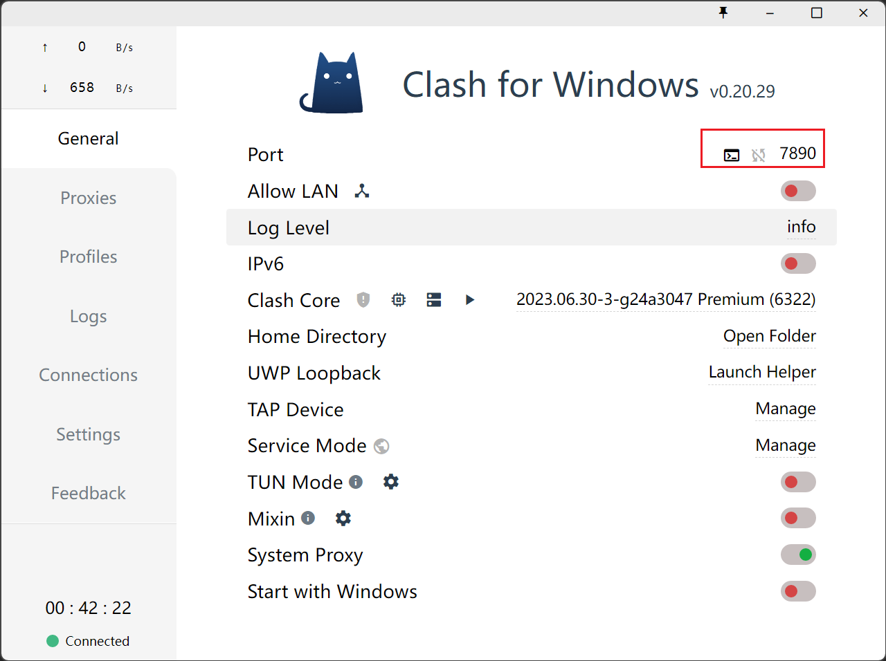

# git-test
git from beginner to master

# git pull or push error
#unable to access 'https://github.com/bdxdh/git-test.git/': Failed to connect to github.com port 443 after 21103 ms: Couldn't connect to server
git config --global http.proxy 127.0.0.1:7890
git config --global https.proxy 127.0.0.1:7890

# unset proxy
git config --global --unset http.proxy
git config --global --unset https.proxy